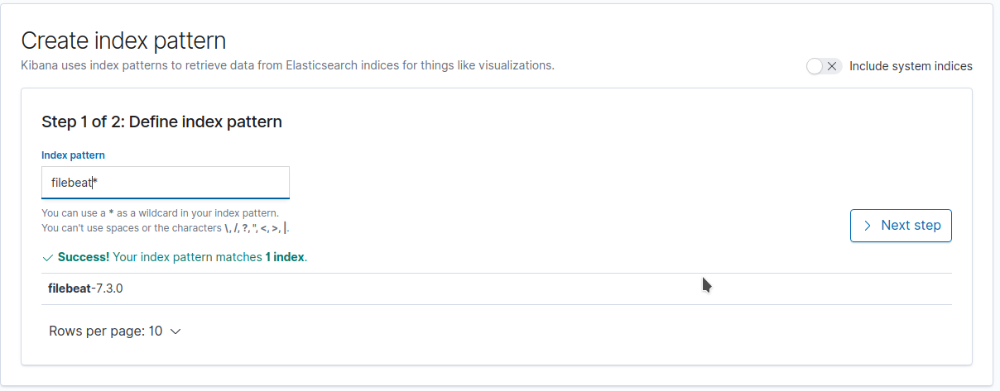
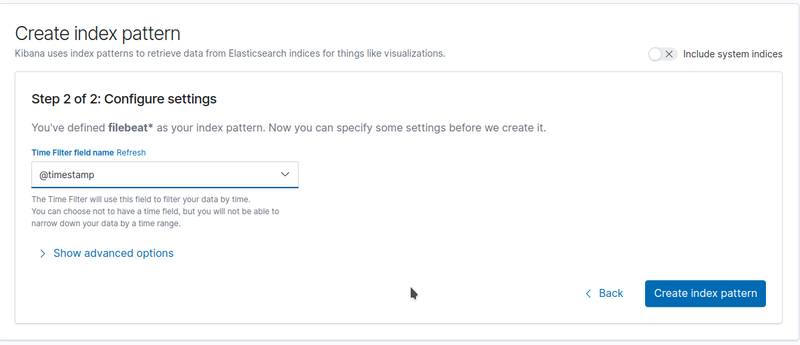
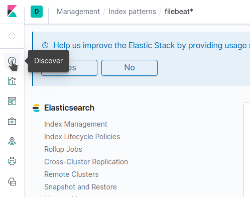
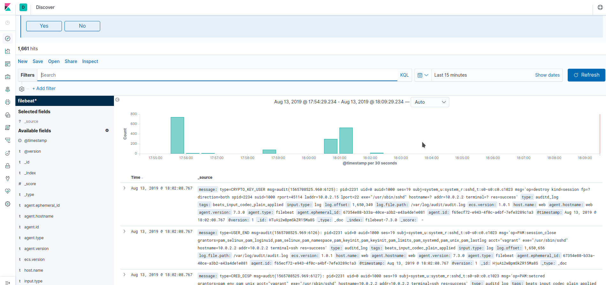
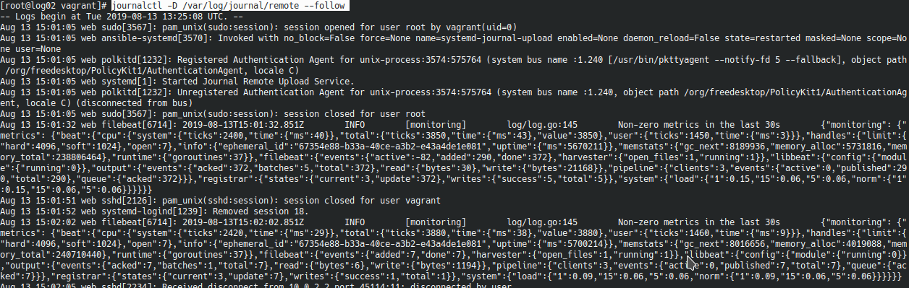

## Централизованное хранение логов
1. Для проверки стенда необходимо скачать:
    1.1. Vagrantfile, ansible.cfg
    1.2. Каталоги roles, playbooks, files и положить их рядом с файлами скачанными в п. 1.1.
2. запускаем vagrant up
3. После запуска будет поднято 3 машины:
    3.1. Web- машина с сервером nginx с которой логи аудита и nginx уходят на сервер с ELK(log01)  через FileBeat, так же с этого хоста с помощью systemd-journal-upload  логи системы уходят на  машину log02
    3.2. Log01 - сервер с Elasticsearch + logstash + kibana
    3.3. log02 - сервер с systemd-journal-remote
4. После того как  сервера поднимуться можно проверить получение логов целевых серверов для хранения логов:

    4.1. Log01 - заходим по http://10.10.10.20  и добавляем индекс в kibana, по умолчанию логин и пароль kibadmin. Файл авторизации для nginx, который закрывает от неавторизованного доступа кибану  задается параметром "src_auth_file" => "./files/src_htpasswd.users", можете указать свой файл.
    Добавление индекса:
    - Нажимаем create index pattern
    

    - вводим filebeat* и жмем Next step
    

    - Выбираем timestamp и жмем create index pattern
    

    - Далее переходим в Discover
    

    - И наблюдаем
    

    4.2. Log02 - заходим по ssh на 10.10.10.21, пользователь vagrant, пароль vagrant.
    Выполняем 
    ```
    journalctl -D /var/log/journal/remote --follow
    ```
    И наблюдаем:
     
