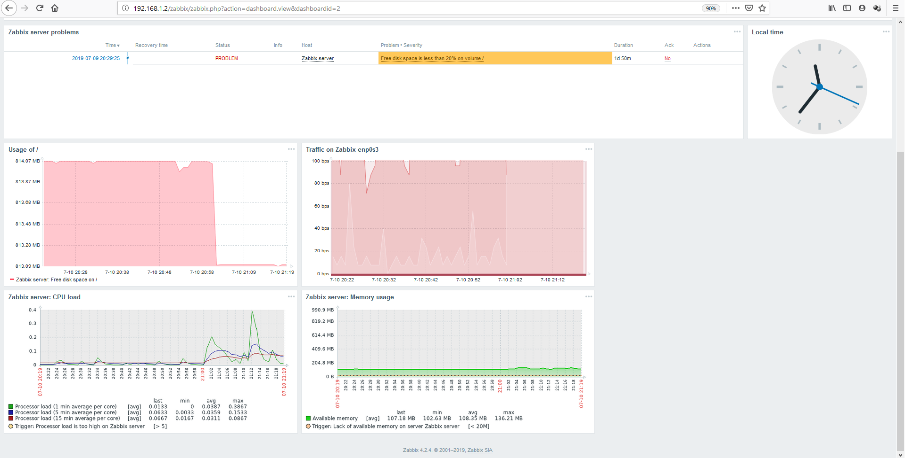
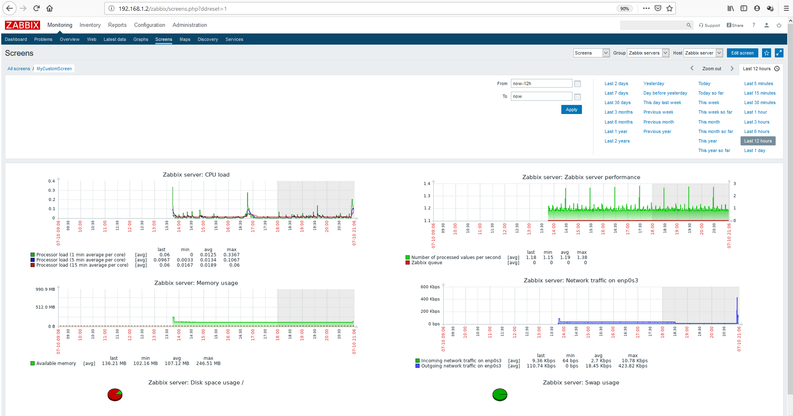

## Мониторинг
1. Zabbix 4.2.4 

    1.1. Dashbord 

1.2. Screen


2. Cacti


3. ICINGA

    3.1. Dasboard
    
    3.2. Service problem overview
    
    

```Лично мои фаворитом, для мониторинга хостов/сервисов и прочего, остается Zabbix. В сравнении с представленными двумя аналогами его развернуть быстрее и проще, а так же у него есть агент, в котором можно реализовывать кастомные параметры (UserParameters).
```