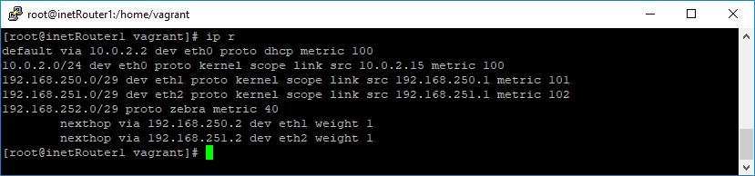
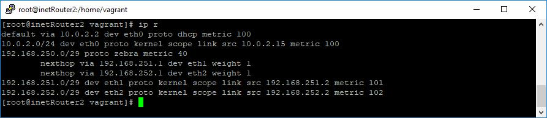
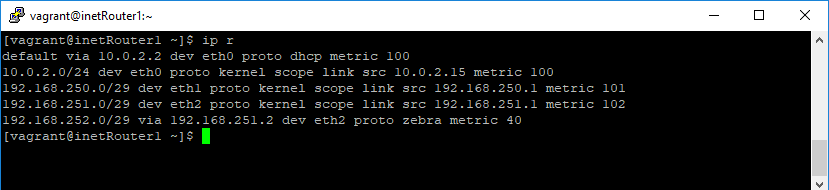

# Динамическая маршрутизация, OSPF, Quagga
OSPF
- Поднять три виртуалки
- Объединить их разными vlan
1. Поднять OSPF между машинами на базе Quagga
2. Изобразить ассиметричный роутинг
3. Сделать один из линков "дорогим", но что бы при этом роутинг был симметричным

До выставления "стоимости" маршрута, таблицы маршрутизации выглядели следующим образом:
1. inetRouter1
    
2. inetRouter2
    
3. inetRouter3
    


Была реализована следующая схема:

    

Таблицы маршрутизации стали  такими:
1. inetRouter1
   
2. inetRouter2
   
3. inetRouter3
   

Для проверки стенда:

1. Скачать [Vagrantfile](./Vagrantfile)б [ansible.cfg](./ansible.cfg), каталоги [files](./files), [playbooks](./playbooks), [roles](./roles).
Файл ansible.cfg и  каталоги files, playbook, roles со всем содержимым должны быть расположены рядом с Vagranfile
2. Выполнить vagrant up  в том каталоге, куда скачали Vagrantfile в п.1.
3. После сборки стенда, можно зайти на inetRouter3 и сделать tracepath до host-ов в сети между inetRouter1  и inetRouter3, машрут пойдет по  дешевому длинному пути.
    ```
    [vagrant@inetRouter3 ~]$ tracepath 192.168.251.1
    1?: [LOCALHOST]                                         pmtu 1500
    1:  192.168.252.2                                         1.271ms
    1:  192.168.252.2                                         0.795ms
    2:  192.168.251.1                                         0.868ms reached
     Resume: pmtu 1500 hops 2 back 2
    ```

    И обратно:

    ```
    [vagrant@inetRouter1 ~]$ tracepath -n 192.168.252.1
    1?: [LOCALHOST]                                         pmtu 1500
    1:  192.168.251.2                                         0.752ms
    1:  192.168.251.2                                         0.567ms
    2:  192.168.252.1                                         0.704ms reached
     Resume: pmtu 1500 hops 2 back 2
    ```

