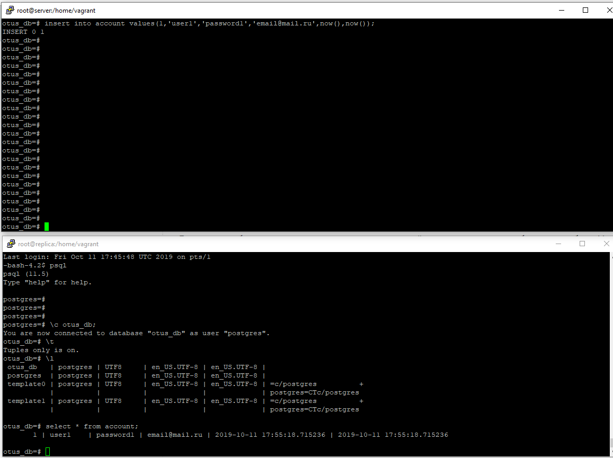
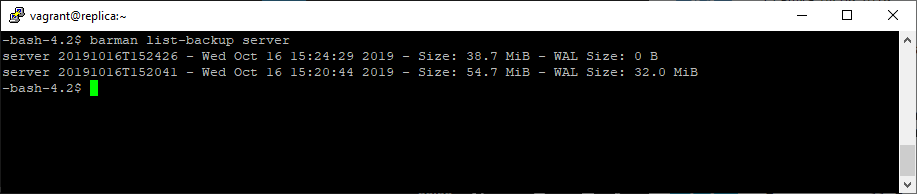

# PosgreSQL, Репликация, BARMAN    
1. Результат  работы реплики  
    
2. Результат работы BARMAN    
    
3. Конфиги:
    [barman.conf](./roles/pgsql-barman/files/barman.conf)
    [server.conf](./roles/pgsql-barman/files/barman_server_bk.conf)
    [pg_hba](./roles/pgsql-server/templates/pg_hba.conf.j2)
    [postgresql.conf](./roles/pgsql-server/templates/postgres.conf.j2)
4. Проверка:
    4.1. Скачиваем каталог [lab-26](../lab-26)  
    4.2. В каталоге с Vagranfile выполняем vagrant up
    4.3. Поднимется 2 инстанса, один **server**, второй **replica**. Replica с барменом на борту. В бармене настроена задача резервного копирования по политике обеспечения точки восстановления в любую точку при глубине 3 дня.

